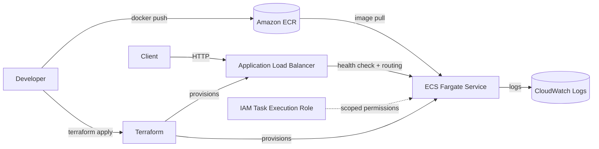

# Fargate Data Ingestion

[](https://github.com/Alireza-Mehdipour/fargate-data-ingestion/actions/workflows/ci.yml)

A containerised FastAPI service running on AWS ECS Fargate, provisioned entirely with Terraform and fronted by an Application Load Balancer.

I built this independently to practice and consolidate the container and Infrastructure as Code concepts I picked up through AWS training and hands-on work experience. The goal was to go beyond a tutorial: modular Terraform, scoped IAM, real health checks, and a CI pipeline that validates every commit.

---

## What It Does

The service exposes a FastAPI application behind a public load balancer. Requests hit the ALB, get routed to a Fargate task running the container, and application logs stream to CloudWatch. All infrastructure is defined in code, so the whole environment can be created or destroyed with a single Terraform command.

**Key features:**

- FastAPI application packaged in a lightweight Docker image
- IAM task execution role with scoped permissions rather than broad access
- Application Load Balancer with health checks and routing
- Private ECR repository for image storage
- Modular Terraform structure split into alb, ecr, ecs and service modules
- CloudWatch logging for observability
- Provider versions pinned via `.terraform.lock.hcl` for reproducible builds
- GitHub Actions pipeline validating Terraform and building the image on every commit

---

## Application Screenshot


The screenshot shows the application running behind the load balancer. The environment has since been destroyed to avoid ongoing cost, and can be recreated in full with `terraform apply`.

---

## Architecture



**AWS services used:**

| Service | Role in this project |
|---|---|
| ECS Fargate | Serverless container compute, no EC2 hosts to manage |
| ECR | Private container registry for the application image |
| ALB | Public entry point, traffic routing and health checks |
| VPC and Subnets | Networking foundation for the service |
| CloudWatch Logs | Application and container logging |
| IAM | Scoped, role based access for the task |

**Deployment flow:**

1. Docker image is built locally and pushed to ECR
2. Terraform provisions the ECS cluster, task definition, service, ALB and networking
3. ECS Fargate pulls the image and runs the FastAPI container
4. The ALB exposes the application publicly and monitors task health
5. Logs stream to CloudWatch for monitoring

---

## Design Decisions

A few choices here were deliberate, and worth explaining:

**Why Fargate over Lambda.** Lambda would be cheaper for pure request handling, but this service is designed around a long lived container with a persistent process and predictable startup behaviour. Fargate avoids cold start concerns for containerised workloads and keeps the deployment artifact a standard Docker image, which is portable to ECS on EC2, or to any other container platform, without a rewrite.

**Why Fargate over ECS on EC2.** There is no cluster capacity to manage, patch or scale. For a service of this size, the operational overhead of managing EC2 instances is not worth the marginal cost saving.

**Why modular Terraform.** Splitting alb, ecr, ecs and service into separate modules keeps each concern independently testable and reusable. It also makes the root configuration readable, which matters more than it sounds once a project grows past a handful of resources.

**Why a scoped IAM execution role.** The task role grants only what the container needs to pull from ECR and write to CloudWatch. It would have been faster to attach a broad managed policy, but least privilege is the habit worth building, and it is the first thing a reviewer looks at.

**Why the provider lock file is committed.** Pinning provider versions means the infrastructure builds the same way months later. Without it, a provider release can quietly change behaviour between runs.

**Why the environment is torn down.** This is a portfolio project, not a production service. Leaving an ALB and a Fargate task running accrues cost every hour for no benefit. The infrastructure is code, so it can be recreated on demand, which is arguably the stronger demonstration.

---

## Repository Structure

```
fargate-data-ingestion/
├── app/                      # FastAPI application and container definition
│   ├── main.py               # API entry point
│   ├── index.html            # Served landing page
│   ├── requirements.txt      # Python dependencies
│   └── Dockerfile            # Docker image definition
│
├── infra/                    # Terraform infrastructure as code
│   ├── modules/              # Reusable modules (ALB, ECS, ECR, Service)
│   ├── main.tf               # Root configuration
│   ├── variables.tf          # Input variables
│   ├── outputs.tf            # Outputs (ALB URL, ECR repository)
│   └── .terraform.lock.hcl   # Provider version lock file
│
├── .github/workflows/        # CI pipeline
├── .gitignore
├── LICENSE                   # MIT License
└── README.md
```

---

## Prerequisites

- AWS account with credentials configured (`aws configure`)
- Terraform 1.x
- Docker
- AWS CLI v2

---

## Local Development

Build and run the FastAPI app locally:

```bash
docker build -t fargate-data-ingestion:v1.0.3 ./app
docker run -p 8000:8000 fargate-data-ingestion:v1.0.3
```

Then visit `http://localhost:8000`.

---

## Deployment

### 1. Build the Docker image

```bash
docker build -t fargate-data-ingestion:v1.0.3 ./app
```

### 2. Authenticate Docker to ECR

```bash
aws ecr get-login-password --region ap-southeast-2 \
  | docker login --username AWS \
  --password-stdin <ACCOUNT_ID>.dkr.ecr.ap-southeast-2.amazonaws.com
```

### 3. Tag the image for ECR

```bash
docker tag fargate-data-ingestion:v1.0.3 \
  <ACCOUNT_ID>.dkr.ecr.ap-southeast-2.amazonaws.com/fargate-data-ingestion:v1.0.3
```

### 4. Push the image to ECR

```bash
docker push \
  <ACCOUNT_ID>.dkr.ecr.ap-southeast-2.amazonaws.com/fargate-data-ingestion:v1.0.3
```

### 5. Provision the infrastructure

```bash
cd infra
terraform init
terraform plan
terraform apply
```

Terraform outputs the ALB URL on completion. ECS Fargate pulls the tagged image from ECR automatically.

### 6. Tear down when finished

```bash
terraform destroy
```

---

## Continuous Integration

A GitHub Actions workflow runs on every commit and validates that the infrastructure and application are in a deployable state:

- `terraform fmt -check` to enforce consistent formatting
- `terraform validate` to catch configuration errors before they reach AWS
- `docker build` to confirm the application image still builds

Running these on every push means a broken configuration is caught in CI rather than halfway through a `terraform apply`.

---

## Terraform Example: Task Definition

```hcl
container_definitions = jsonencode([
  {
    name      = "fastapi-app"
    image     = "<ACCOUNT_ID>.dkr.ecr.ap-southeast-2.amazonaws.com/fargate-data-ingestion:v1.0.3"
    essential = true

    portMappings = [
      {
        containerPort = 8000
        hostPort      = 8000
        protocol      = "tcp"
      }
    ]

    logConfiguration = {
      logDriver = "awslogs"
      options = {
        awslogs-group         = "/ecs/fargate-data-ingestion"
        awslogs-region        = "ap-southeast-2"
        awslogs-stream-prefix = "ecs"
      }
    }
  }
])
```

---

## Known Limitations and Next Steps

This is a portfolio project, and there are things a production deployment would need that are deliberately out of scope here:

- **No HTTPS.** The ALB serves HTTP only. Production would need an ACM certificate and an HTTPS listener with HTTP redirect.
- **No remote Terraform state.** State is local. A team setup would use an S3 backend with DynamoDB state locking.
- **Single environment.** No dev, staging or prod separation. Terraform workspaces or separate state files would handle this.
- **No autoscaling.** The service runs a fixed task count. ECS service autoscaling on CPU or request count would be the next addition.
- **No custom domain.** Access is via the raw ALB DNS name rather than a Route 53 record.

---

## Author

**Alireza Mehdipour**
Cloud and DevOps Engineer, Melbourne
LinkedIn: [linkedin.com/in/ali-mehdipour-886686229](https://www.linkedin.com/in/ali-mehdipour-886686229/)
GitHub: [github.com/Alireza-Mehdipour](https://github.com/Alireza-Mehdipour)

---

## License

MIT License. Free to use, modify and share.
